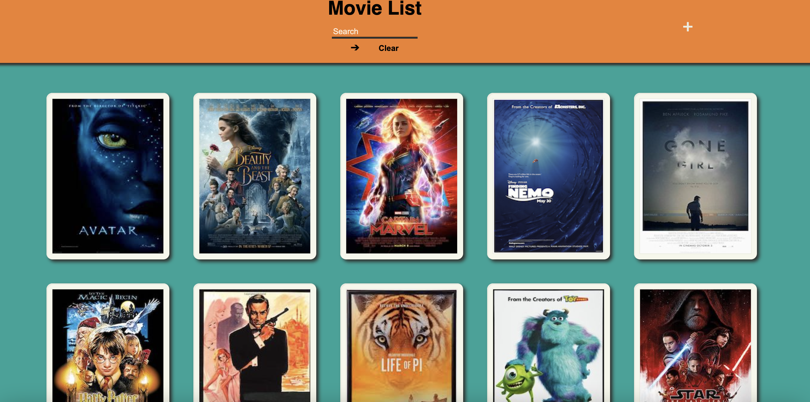
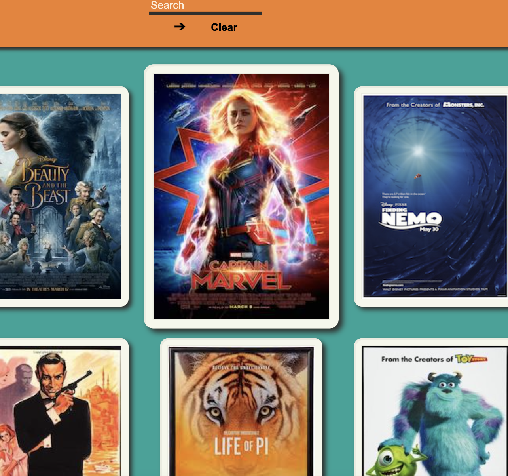
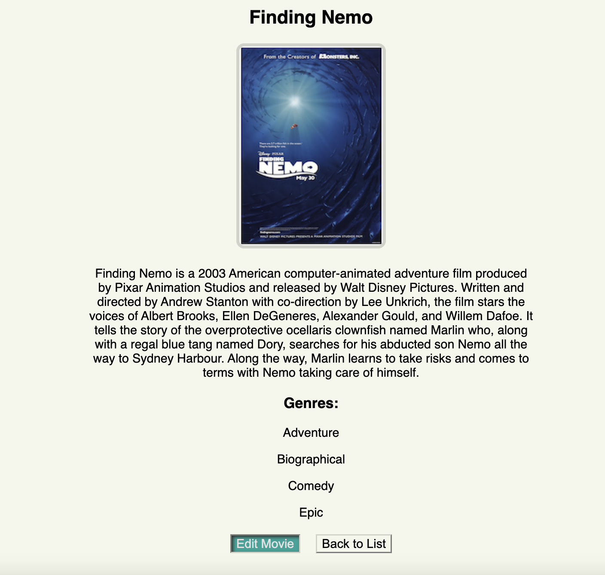
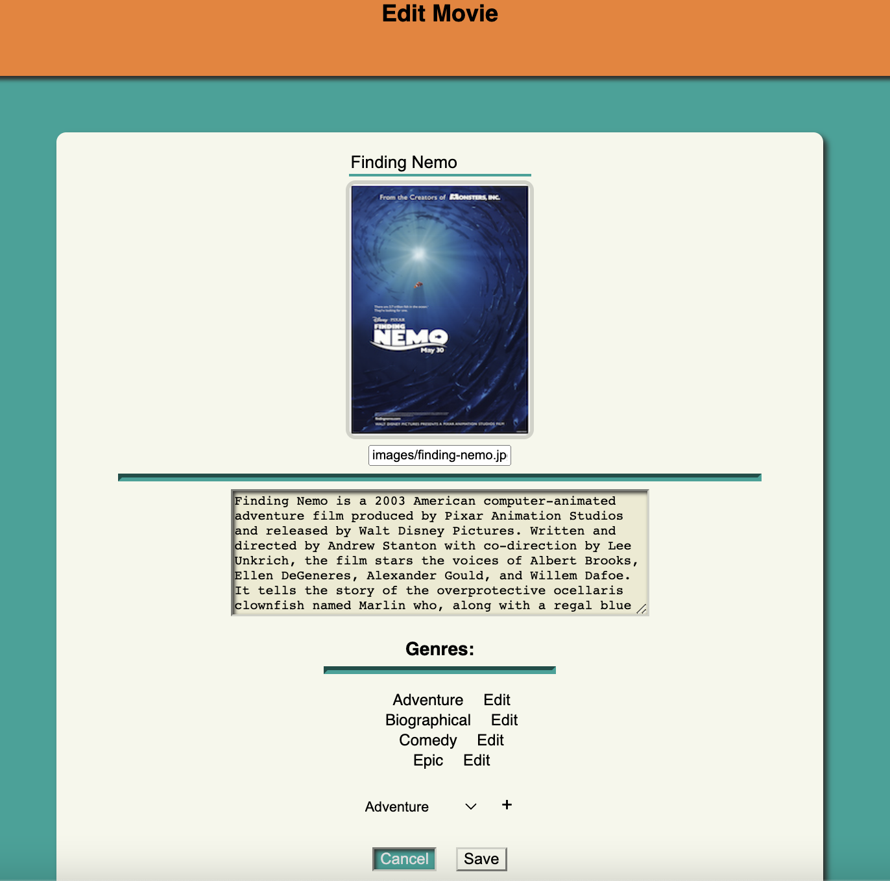
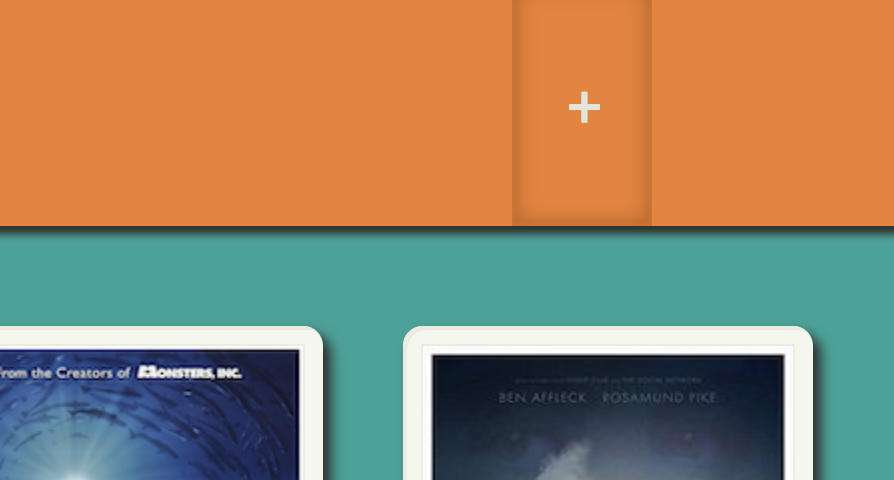
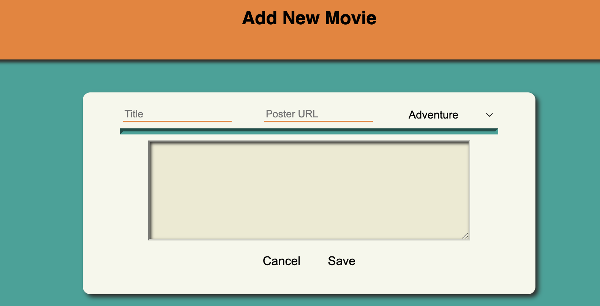

# Movie Sagas

## Description

_Duration: 2 Day Sprint_

This application is a showcase for your movie collection. You can add a new movie, edit movie details, and see all of your movies.

## Previews

## Usage

1. The user can click on a movie poster to view details about it.

    

2. On the details page the user may click on `Edit` to jump to the edit where the user can make changes to the movie details.

    

3. Back on the home page there is a `plus` button that when clicked brings the user to an add movie page.

    

4. On the add movie page the user can add a new movie to the database and view it on the homepage after it has been added.

    

## Prerequisites

-[node js](https://nodejs.org/en/)

-[npm](https://docs.npmjs.com/)

## Built With

-[React](https://reactjs.org/)

-[React-Redux](https://react-redux.js.org/)

## Acknowledgement
Thanks to [Emerging Digital Academy](https://emergingacademy.org/) for supplying me with the resources to complete this project.

## Support
If you have any questions, suggestions, or issues, please email me at [david.wesley.lindberg@gmail.com](www.google.com)